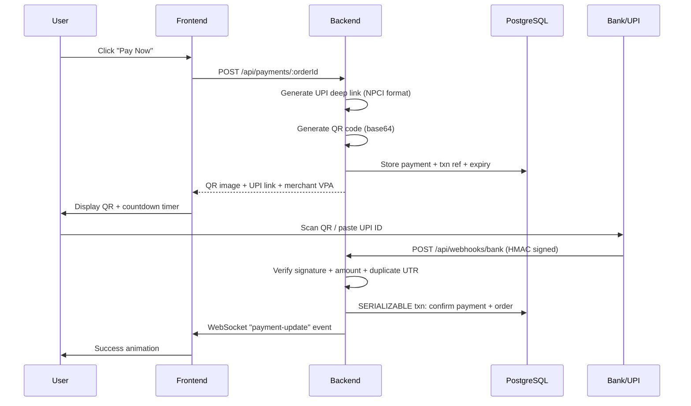

# NimbusCart — Razorpay → Native UPI QR Migration Walkthrough

## Summary

Replaced all Razorpay payment gateway dependencies with a **production-grade native UPI QR payment architecture** using NPCI-compliant deep links, bank webhook verification, and reconciliation fallback.

## Files Changed (14 files)

### Backend Core

| File | Change |
|------|--------|
| `backend/src/services/payment.service.js` | Complete rewrite: UPI deep link generation, bank webhook handler (HMAC + SERIALIZABLE txn), manual reconciliation, cron-based payment expiry |
| `backend/src/routes/webhook.routes.js` | Bank webhook with IP whitelist + dev `/simulate` endpoint |
| `backend/src/routes/payment.routes.js` | Added `POST /:orderId/confirm` for manual "I Have Paid" |
| `backend/src/services/cron.service.js` | **[NEW]** Expire unpaid payments + cleanup stale carts |
| `backend/server.js` | Added cron service initialization |

### Configuration

| File | Change |
|------|--------|
| `backend/src/config/env.js` | `RAZORPAY_*` → `UPI_MERCHANT_VPA`, `UPI_MERCHANT_NAME`, `BANK_WEBHOOK_SECRET` |
| `backend/package.json` | Removed `razorpay`, added `node-cron` |
| `backend/src/app.js` | Removed `api.razorpay.com` from CSP |
| `.env.example` | UPI + bank webhook env vars |
| `docker-compose.yml` | Updated backend env vars |

### Database

| File | Change |
|------|--------|
| `backend/migrations/001_initial_schema.sql` | UPI columns (`upi_transaction_ref`, `utr_number`, `upi_deep_link`, `reconciliation_status`) + `bank_transactions` table |
| `backend/database/schema.sql` | Matching changes for reference schema |

### Infrastructure

| File | Change |
|------|--------|
| `kubernetes/ingress.yaml` | K8s secrets: UPI/bank webhook credentials |

### Frontend

| File | Change |
|------|--------|
| `frontend/src/pages/PaymentStatus.jsx` | UPI QR display, "Copy UPI ID", "Open UPI App" deep link, manual confirm with UTR input, animated states |

## Payment Flow (New Architecture)

## Verification

- ✅ `npm install` succeeded — `razorpay` removed, `node-cron` added
- ✅ Zero Razorpay references remaining in source code (only "No Razorpay" comments)
- ✅ All 14 files updated consistently
- ✅ Schema includes `bank_transactions` table for UTR reconciliation
- ✅ Frontend supports QR scan, UPI ID copy, deep link, and manual confirm fallback
